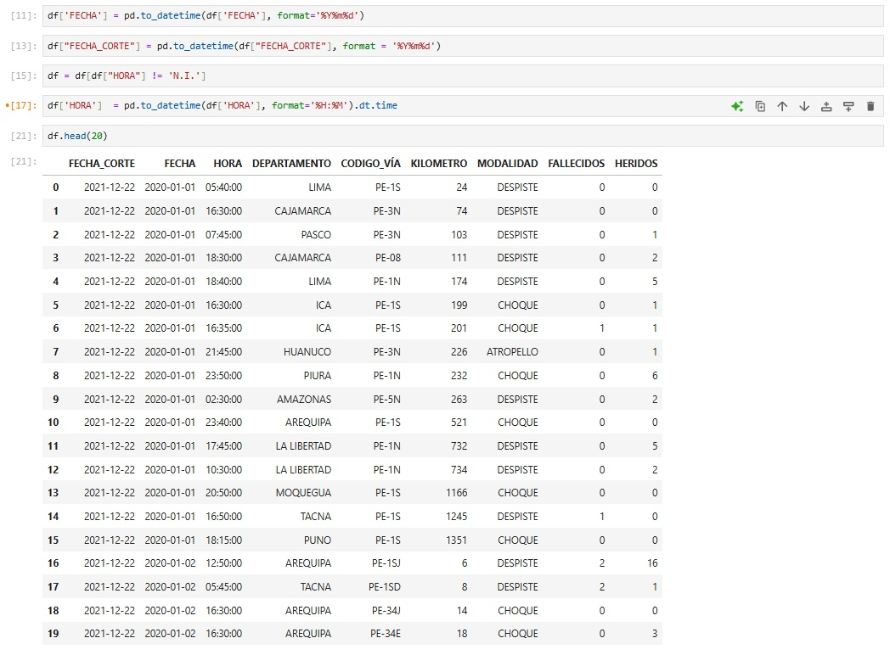
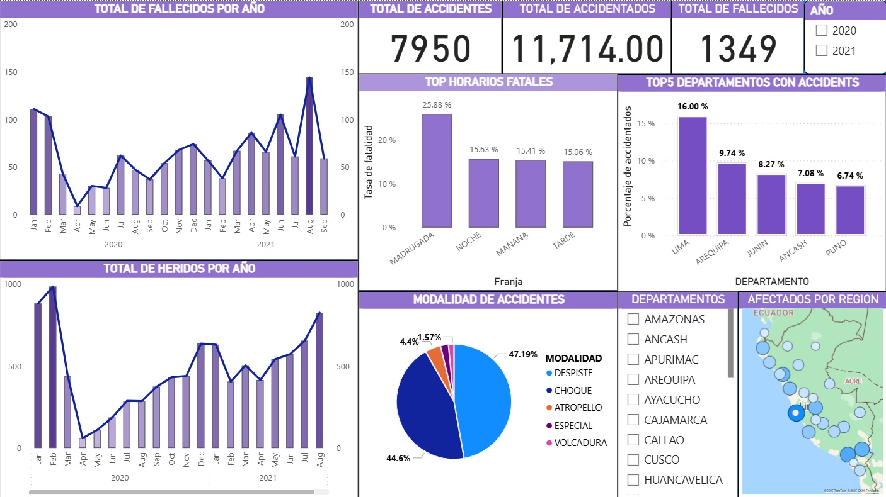

# Análisis de Accidentes de Tránsito en Carreteras

El siguiente proyecto tiene como objetivo **analizar** los accidentes registrados en carreteras, utilizando técnicas de *Data Analysis* y visualización.
El dataset se puede descargar del siguiente enlace: https://datosabiertos.gob.pe/dataset/accidentes-de-tr%C3%A1nsito-en-carreteras
# Limpieza de datos utilizando Python
Para la limpieza de datos se utilizo python, basicamente para cambiar el valor de Fecha, eliminar valroes nulos o diferentes siempre y cuando estos sean menor al 10% de datos. Como se puede apreciar en las imagenes.
  

# Análisis de datos en PowerBi
Para el análisis de datos se utilizo el entorno de PowerBi.  Como se aprecia en el Dashboard 1. Primero se hizo la creación de un nuevo calendario y la relación entre ella y los datos, asi mismo se cambio las regiones a tipo de dato de **lugar**. Consecuentemente se hizo las measure que se consideraba importantes para el proyecto. Tales como: Comparacion de fallecidos y heridos con el año pasado, Numero total de fallecidos, Numero total de heridos, Tasa de fatalidad. Con estos datos se procedio a elaborar el **Dashboard1**, el total de accidentes duran el año 2020 y 2021 fue de 7950, con un total de accidentados de 11,714. Dando un total de 1349 fallecidos. Segun la gráfica de pastel, el departamento con mayor cantidad de accidentes es Lima con 16%, seguido por Arequipa con 9.74%, Junin con 8.27%, Ancash 7.08% y Puno con 6.74%. Estos 5 departamentos acumulan el 47.83% de los accidentes nacionales. Los horarios más fatales son la madrugada, seguido de la noche, mañana y tarde. En la madrugada un accidente tiene una tasa de fatalidad de 25.88% que es alta. La modalidad más comun es despiste con un 47.19%, seguido de choque con 44.6%, atropello en 4.4% y volcadura en 1.57%. En el **Dashboard2** se puede apreciar en la imagen 1, que en el mes de abril hubo un incremento de los fallecidos en 855.56% con respecto al año pasado, mientras que los heridos solo hubo un incremento en el mes de abril. Por otro lado, la modalidad de accidente con más fatalidades es el atropello con 44.29 de indice de fatalidad mientras que Volcadura tiene un ratio de 6.40% con una tasa de fatalidad de 17%. La vía con más fallecidos es la PE-1N
### Dashboard de análisis de accidentes

### Dashboard de análisis de accidentes
 

