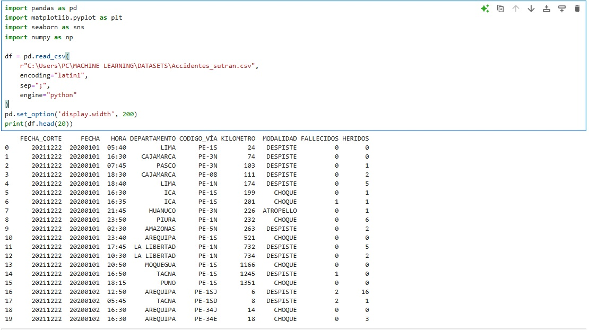
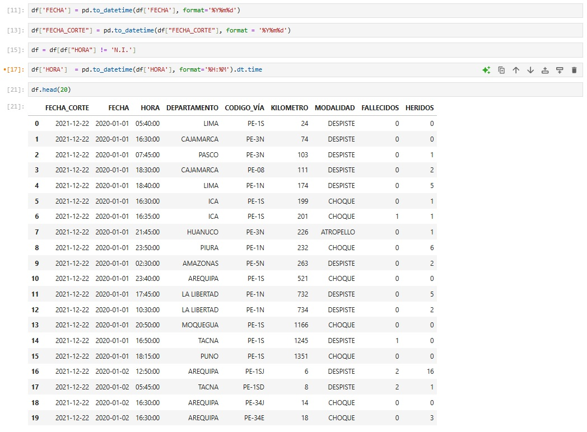
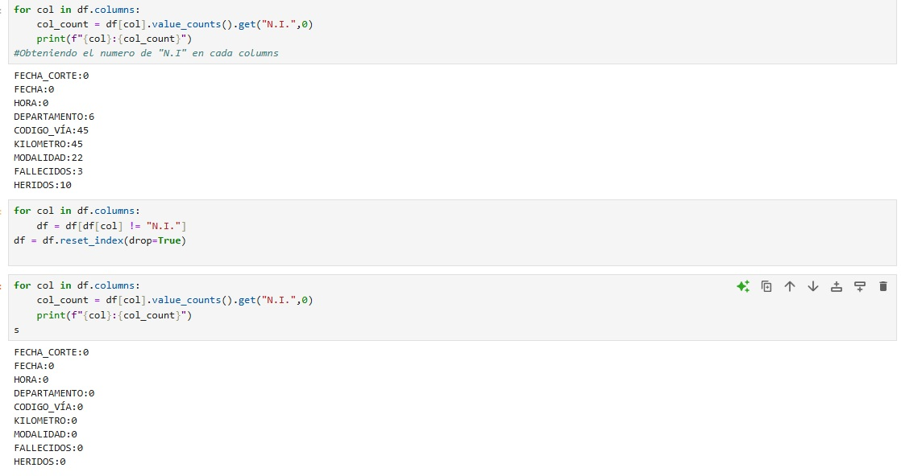

# Análisis de Accidentes de Tránsito en Carreteras

El siguiente proyecto tiene como objetivo **analizar** los accidentes registrados en carreteras, utilizando técnicas de *Data Analysis* y visualización.
El dataset se puede descargar del siguiente enlace: https://datosabiertos.gob.pe/dataset/accidentes-de-tr%C3%A1nsito-en-carreteras
# Limpieza de datos utilizando Python
Para la limpieza de datos se utilizo python, basicamente para cambiar el valor de Fecha, eliminar valroes nulos o diferentes siempre y cuando estos sean menor al 10% de datos. Como se puede apreciar en las imagenes.
  

# Análisis de datos en PowerBi
Para el análisis de datos se utilizo el entorno de PowerBi.  Como se aprecia en el Dashboard 1. Primero se hizo la creación de un nuevo calendario y la relación entre ella y los datos, asi mismo se cambio las regiones a tipo de dato de **lugar**. Consecuentemente se hizo las measure que se consideraba importantes para el proyecto. Tales como: Comparacion de fallecidos y heridos con el año pasado, Numero total de fallecidos, Numero total de heridos, Tasa de fatalidad. Con estos datos se procedio a elaborar el **Dashboard1**, el total de accidentes duran el año 2020 y 2021 fue de 7950, con un total de accidentados de 11,714. Dando un total de 1349 fallecidos. Segun la gráfica de pastel, el departamento con mayor cantidad de accidentes es Lima, seguido de Arequipa

